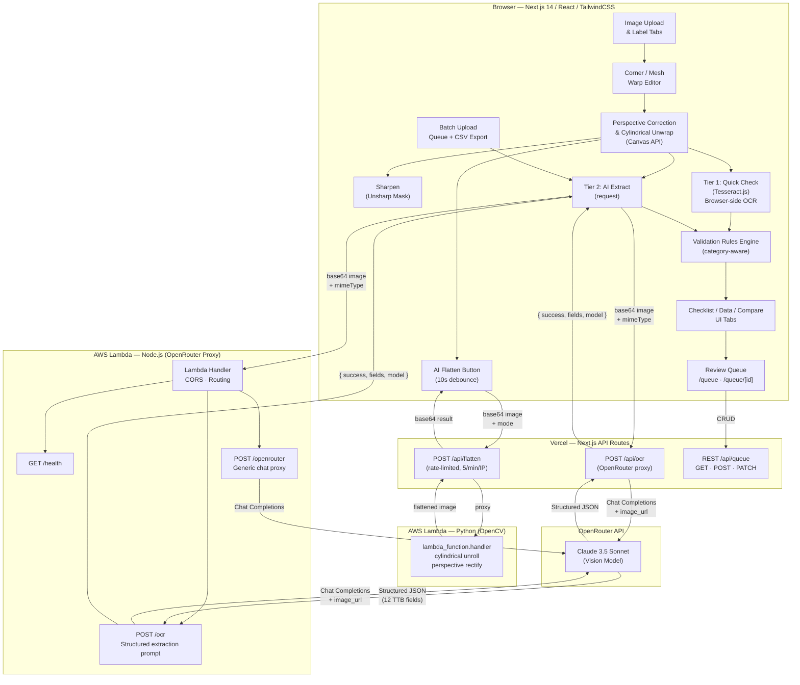
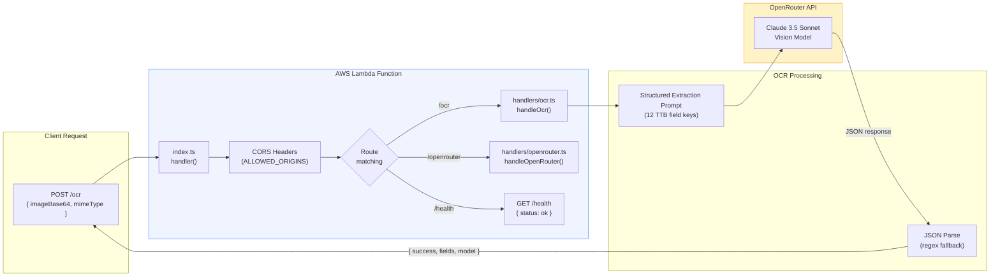
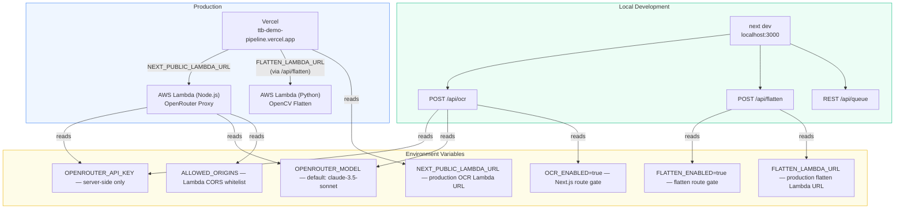
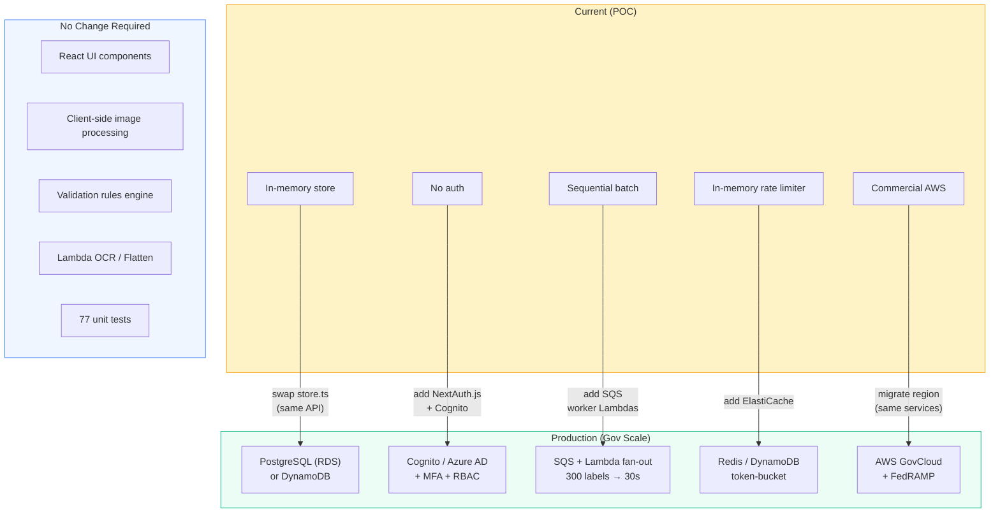

# TTB Label Validator

AI-powered alcohol label verification tool for TTB (Alcohol and Tobacco Tax and Trade Bureau) compliance. Agents review label submissions by comparing what the applicant claimed on their COLA form against what's actually printed on the label — with OCR-powered pre-verification to speed up the process.

## Deliverables

| Deliverable | Status | Location |
|-------------|--------|----------|
| Source Code Repository | ✅ | [github.com/andyagtech/ttb-label-validator](https://github.com/andyagtech/ttb-label-validator) |
| All source code | ✅ | `frontend/`, `backend/`, `docs/` |
| README with setup & run instructions | ✅ | This file |
| Documentation of approach & assumptions | ✅ | [Approach & Core Concept](#approach--core-concept) below, plus `docs/INFRASTRUCTURE_JUSTIFICATION.md` |
| Deployed Application URL | ✅ | **[https://ttb-demo-pipeline.vercel.app](https://ttb-demo-pipeline.vercel.app)** |
| Working prototype | ✅ | Live at the URL above — 24 pre-loaded submissions ready to review |

## Quick Start

### Prerequisites

- Node.js 20+
- npm

### Run Locally

```bash
cd frontend
npm install
npm run dev
# → http://localhost:3000
```

The app runs with **zero configuration** — the review queue, Text Detect (Tesseract.js), form-vs-label verification, and all UI features work out of the box. Optional API keys unlock additional capabilities:

### Environment Variables

Create `frontend/.env.local`:

```env
# ── Required: none! The app runs without any env vars. ──
# All core features (review queue, Text Detect, validation) work immediately.

# ── Optional: unlock additional AI features ──

# Browser-side OCR — Tesseract.js (enabled by default in production)
NEXT_PUBLIC_TESSERACT_ENABLED=true

# Server-side OCR — Claude 3.5 Sonnet via OpenRouter
# Enables the "AI Extract" button for higher-accuracy structured field extraction.
OCR_ENABLED=true
OPENROUTER_API_KEY=sk-or-...
OPENROUTER_MODEL=anthropic/claude-3.5-sonnet

# AI Test Label Generation — Google Gemini
# Enables the /generate page to create photorealistic label images for testing.
GEMINI_API_KEY=your-gemini-api-key

# AI Image Flatten — AWS Lambda (Python/OpenCV)
# Enables the "AI Flatten" button for cylindrical unwrap and perspective correction.
FLATTEN_ENABLED=true
FLATTEN_LAMBDA_URL=https://your-flatten-lambda-url.lambda-url.us-east-1.on.aws

# Production OCR proxy — AWS Lambda (optional, falls back to /api/ocr)
NEXT_PUBLIC_LAMBDA_URL=https://your-lambda-url.lambda-url.us-east-1.on.aws

# Vercel Blob Storage — persists AI-generated label images across deploys
BLOB_READ_WRITE_TOKEN=vercel_blob_...
```

### Run Tests

```bash
cd frontend
npm test          # 77 tests across 3 suites
```

## Approach & Core Concept

### The Problem

TTB agents review ~150,000 label applications per year. For each one, they compare what the applicant wrote on their COLA form (brand name, ABV, net contents, etc.) against what's actually printed on the label artwork. This is largely manual data-entry verification — "matching" in the agents' own words.

### Our Solution: Pre-Verification Pipeline

We built a tool that **pre-verifies** submissions before an agent even looks at them:

1. **Submitter** uploads label images and fills out their COLA form fields (brand name, class/type, ABV, net contents, etc.)
2. **System** runs OCR on the label images to extract what's actually printed on them
3. **Agent** opens the submission and sees a side-by-side comparison: *"What the user submitted"* vs. *"What we detected on the label"* — with match/mismatch indicators on every field
4. **Agent** clicks checkboxes to confirm each field, or clicks **Quick Reject** to auto-generate findings from all mismatches

This turns a 5–10 minute manual review into a quick scan of pre-populated results. The agent's job shifts from "read every field on the label and compare it to the form" to "verify the system's pre-check and handle edge cases."

### Key Design Decisions

- **Tesseract.js (browser-side OCR)** for the "Text Detect" button — runs entirely in-browser, no API key needed, ~2-3 seconds. Used by agents to extract text from label images on demand.
- **Claude 3.5 Sonnet (server-side OCR)** for "AI Extract" — higher accuracy structured extraction when available, but requires an API key.
- **Levenshtein fuzzy matching** for form-vs-label comparison — handles real-world differences like "STONE'S THROW" vs "Stone's Throw" (a real case from the senior agent's experience).
- **Category-aware validation rules** — different checks for beer, wine, and spirits per TTB regulations (e.g., ABV is optional for malt beverages per 27 CFR 7.71).
- **Client-side image processing** — perspective correction, mesh warping, and sharpening all run in the browser. No upload latency, works offline for the editing workflow.
- **In-memory store** — prototype uses a server-side singleton; designed for easy swap to PostgreSQL/DynamoDB in production (same API surface).

### Assumptions

- This is a standalone proof-of-concept, not integrated with the actual COLA system
- No authentication required for the prototype (production would use Cognito/Azure AD)
- Label images are either AI-generated test labels or uploaded photos — no direct camera capture
- The 24 mock submissions use realistic data from the TTB Public COLA Registry

## Testing the Agent Workflow

The fastest way to see the core functionality:

### 1. Open the Review Queue

Go to **[/queue](https://ttb-demo-pipeline.vercel.app/queue)** — you'll see 24 pre-loaded submissions with status badges, typeahead search, and pagination.

### 2. Pick a Submission

Click any **"Submitted"** item (e.g., Sierra Nevada Pale Ale). This opens the agent review workspace.

### 3. Run Text Detect

Click the orange **"Text Detect"** button. This runs Tesseract.js on both front and back label images, extracts text, and parses it into structured fields (brand name, ABV, net contents, government warning, etc.).

### 4. Review Form vs. Label

The right panel shows a side-by-side table:
- **Submitted (Form)** — what the applicant claimed on their COLA application
- **Detected (Label)** — what was actually found on the label image
- **Checkboxes** — click each row to confirm you've verified it
- **Color coding** — green = match, yellow = close, red = mismatch
- **REQ badge** — legally required fields (brand name, class/type, net contents, health warning, name & address)

### 5. Make a Decision

Use the decision panel on the right: **Approve**, **Reject**, **Needs Revision**, or **Escalate**. The **Quick Reject** button auto-populates findings from all detected mismatches and missing required fields.

### Also Try

- **Search**: type "bourbon" or "beer" in the queue search bar — filters instantly as you type
- **Pre-reviewed items**: click Patron Silver Tequila (rejected — missing country of origin) or Maker's Mark (needs revision — government warning in title case instead of ALL CAPS)
- **Submission Simulator** (`/`): upload your own label image, run through the full correction → OCR → validation pipeline, then submit to the agent queue

## Architecture

### System Overview



### Backend Detail



### Environment & Deployment



### Production Path

The current prototype is serverless-first and infrastructure-agnostic. The same application logic runs on production backing services with no rewrites. See [`docs/INFRASTRUCTURE_JUSTIFICATION.md`](docs/INFRASTRUCTURE_JUSTIFICATION.md) for full capacity analysis.



**This is an agent-facing tool.** The primary users are 47 TTB compliance agents reviewing ~605 label applications per business day. The prototype has two views: an **Agent Review View** (review queue, pre-processed fields, validation, checklist, approve/reject) and a **Submission Simulator** (image upload, correction, OCR — simulating what a backend ingestion pipeline would produce from COLA). At production scale, Lambda compute uses **<5% of default capacity** and total annual cost is ~$1,800 vs. $50K–$200K for vendor alternatives. Full analysis: [`docs/INFRASTRUCTURE_JUSTIFICATION.md`](docs/INFRASTRUCTURE_JUSTIFICATION.md).

### Two-Tier OCR Strategy

| | Tier 1: Quick Check | Tier 2: AI Extract |
|---|---|---|
| **Purpose** | Pre-submission self-check | Prepare file for human review |
| **Tech** | Tesseract.js (browser) | Claude 3.5 Sonnet (server) |
| **Speed** | ~2-3s, no network | ~3-5s, network + inference |
| **Output** | Raw text → heuristic parsing | Structured JSON fields |
| **Who uses it** | Submitter | Reviewing agent |
| **Accuracy** | Basic presence detection | High — structured extraction |

The Lambda proxy keeps the OpenRouter API key server-side. CORS is configured for the Vercel deployment domain.

## Features

### Image Processing
- **Perspective correction** — 4-point corner alignment with bilinear interpolation
- **Cylindrical unwrap** — compensate for label curvature on round bottles/cans
- **Mesh warp** — multi-point spline-based edge tracing for precise flattening
- **Auto-flatten** (photos) — automatic curvature estimation via Sobel edge orientation analysis
- **AI Smart Crop** (graphics) — edge-detection-based label boundary estimation for flat design files
- **Multi-label auto-split** — detects landscape/portrait orientation, splits image into Front+Back with auto-set corners
- **Configurable control points** — 3-6 points per edge for mesh warp

### OCR & Validation
- **Quick Check** — browser-side OCR (Tesseract.js) for instant pre-submission feedback
- **AI Extract** — vision model (Claude 3.5 Sonnet) extracts all TTB-required fields as structured data
- **Data tab** — view and edit all extracted fields, re-run validation, view raw OCR text and JSON
- **Compare tab** — enter COLA application form values, fuzzy-match against OCR-extracted label data with similarity scoring
- **Class/type designation lookup** — validates against ~150 known TTB designations per category; flags cross-category mismatches
- **Validation rules engine** with three rule categories:
  - **Presence rules** — are required fields present? (brand name, class/type, ABV, etc.)
  - **Format rules** — does the content match TTB formatting requirements?
    - Government warning: all-caps "GOVERNMENT WARNING:", both prescribed statements
    - ABV: rejects "ABV" abbreviation, accepts "Alcohol __% by volume", "__% Alc. By Vol.", "__% Alc./Vol." + parenthetical forms
    - Net contents: category-aware — American measure required for beer, metric for wine/spirits
    - ABV optionality: mandatory for wine/spirits, optional for malt beverages per 27 CFR 7.71
  - **Cross-field rules** — conditional logic (varietal → appellation required, vintage → appellation required)

### User Experience
- **Guided onboarding** — coach marks, beverage category selector, graphic vs. photo chooser
- **Category-aware checklist** — different rules for wine, beer, and spirits
- **Multi-label question** — "Does this file have more than one label?" with auto-split into Front+Back
- **Front/back label tabs** — plus custom label slots (strip labels, neck labels)
- **Data tab** — inspect, edit, and re-validate extracted fields; view raw text and JSON
- **Inline value editing** — correct OCR results directly in the checklist
- **Auto-detected vs manual items** — clear visual distinction with confidence scores
- **Batch upload** — multi-file drag-and-drop, sequential OCR processing with progress tracking, CSV export of results
- **Compare tab** — side-by-side form-vs-label comparison with Levenshtein fuzzy matching (handles Dave's "STONE'S THROW" vs "Stone's Throw" case)
- **High-resolution export** — PNG or JPEG with quality control

### API Test Page
- **`/api-test` page** — interactive endpoint tester with sample label gallery (6 images), file upload, JSON body editor, and syntax-highlighted response viewer
- **Endpoint picker** — supports all API routes: `POST /api/ocr`, `GET /api/queue`, `POST /api/queue`, `GET /api/queue/{id}`, `PATCH /api/queue/{id}`, `POST /api/queue/{id}`
- **Response panel** — status code, response time, copy-to-clipboard, dark-themed JSON with syntax highlighting

### Guided Walkthrough
- **Question-mark FAB** — fixed bottom-left button using `question-mark.svg`, opens a right-side panel
- **8-step tutorial** — walks through: Choose Category → Upload Image → Correct Perspective → Run OCR → Review Checklist → Inspect Data → Compare with Form → Submit for Review
- **Element highlighting** — active step pulses/glows the relevant UI element on the main page
- **Keyboard navigation** — arrow keys to navigate, Escape to close
- **Step-specific tips** — contextual hints for category selection, OCR performance, Dave's fuzzy matching case

### Image Sharpening
- **Sharpen button** — in the editor toolbar (amber gradient), applies client-side unsharp mask convolution
- **Laplacian kernel** — center-weighted sharpening at amount=0.6 for improved text clarity
- **No network required** — runs entirely in-browser via Canvas API pixel manipulation
- **Stackable** — can be applied multiple times for stronger effect

### AI Flatten (OpenCV Lambda)
- **Two modes** — "Bottle" (cylindrical unroll) for curved bottle labels, "Flat" (perspective rectify) for angled/flat-surface labels
- **Cylindrical projection** — uses `f * tan((x - cx) / f)` mapping to compensate for bottle curvature, with vertical stretch via `sec(x/f)`
- **Perspective rectification** — detects largest rectangular contour via Canny edges + contour approximation, applies 4-point warp with auto-orientation
- **Python Lambda** — OpenCV-powered (`backend/flatten/`), uses Klayers opencv-python-headless layer, 2048 MB memory
- **SAM template** — `backend/flatten/template.yaml` for one-command deployment via `sam deploy`
- **Unsharp mask post-processing** — light sharpening applied after both flatten modes for crisp text
- **Debounce** — 10-second client-side cooldown after each request; server-side rate limit of 5 requests/minute/IP with `X-RateLimit-*` headers
- **Split button UI** — pink/rose gradient button with mode dropdown (Bottle/Flat) in the editor toolbar
- **Result banner** — shows mode, focal length, output dimensions; error state with red styling
- **API route** — `POST /api/flatten` with `{ imageBase64, mode, mimeType, focalMultiplier? }`

### Test Label Generator (Gemini AI)
- **`/generate` page** — AI-powered test label image generator using Google Gemini 2.5 Flash Image (Nano Banana)
- **10 presets** — bourbon front/back, craft IPA front/back, cabernet front/back, imported vodka front/back, malt beverage front, rosé wine front — inspired by `sample_labels/`
- **Prompt builder** — automatically constructs detailed prompts from label fields (brand name, class/type, ABV, net contents, appellation, vintage, name & address, country of origin)
- **Front vs. back labels** — front labels generate photorealistic product photos; back labels include the exact government warning text with ALL CAPS requirement
- **Custom prompt mode** — switch from structured fields to freeform text-to-image prompts
- **Generation history** — last 20 generated images shown as clickable thumbnail grid
- **Send to Simulator** — one-click transfer of generated image to the Submission Simulator via `sessionStorage`
- **Download** — save generated PNG directly to disk
- **Prompt viewer** — collapsible panel showing the exact prompt sent to Gemini, with copy-to-clipboard
- **API route** — `GET /api/generate-label` (list presets) + `POST /api/generate-label` (generate image)
- **Model** — `gemini-2.5-flash-image` (Nano Banana) via REST API, optimized for speed (1024px output)
- **Auth** — `GEMINI_API_KEY` env var, never exposed to the browser

### Review Queue (Agent View)
- **`/queue` page** — dashboard showing all submissions with status badges, category icons, submitter, timestamps, and filter tabs (All / Pending / Reviewed). **Typeahead search** filters instantly as you type across product name, submitter, category, and ID. Pagination for large queues.
- **`/queue/[id]` review page** — full agent review workspace with 4-tab layout:
  - **Label + Data** (side-by-side) — label artwork on the left; **Form vs. Label Verification** table on the right showing submitted form data vs. detected OCR data with interactive checkboxes, match/mismatch color coding, and **REQ** badges on legally required fields. Multi-label selector for front/back labels.
  - **Checklist** — per-label compliance checklist with auto_pass/auto_fail/manual status
  - **Form Comparison** — auto-computed fuzzy matching of COLA application form fields vs. label OCR, with field-by-field verdicts (exact/match/close/mismatch/missing), percentage scores, and summary bar
  - **History** — full audit trail of previous reviews with findings
- **Text Detect** — orange button runs **Tesseract.js** on front + back label images, parses raw OCR into structured fields (brand name, class/type, ABV, net contents, government warning, name & address, etc.), and populates the comparison table. No API key required.
- **Government Warning check** — verifies "GOVERNMENT WARNING:" is in ALL CAPS (title case is rejected per TTB rules)
- **Quick Reject** — one-click button that auto-populates findings from all detected mismatches and missing required fields, sets the decision to "Reject", and writes a summary note
- **Decision panel** — sticky sidebar with reviewer name, decision buttons (Approve / Reject / Needs Revision / Escalate), findings editor, and notes
- **Live timer** — tracks active review time per session
- **End-to-end flow** — "Submit to Agent Queue" button on the Submission Simulator sends processed images, checklists, and OCR-extracted fields to the agent review queue. Agent sees the actual corrected label artwork.
- **Mock seed data** — 24 realistic submissions across beer/wine/spirits with various statuses, pre-populated COLA form fields, and label images
- **REST API** — `GET /api/queue`, `POST /api/queue`, `GET /api/queue/[id]`, `PATCH /api/queue/[id]`, `POST /api/queue/[id]` (submit review)

## Technical Stack

| Layer | Technology |
|---|---|
| Framework | Next.js 14 (App Router) |
| Language | TypeScript |
| UI | React 18, TailwindCSS, Lucide icons |
| Image Processing | HTML5 Canvas API |
| Browser OCR | Tesseract.js |
| Server OCR | OpenRouter → Claude 3.5 Sonnet (vision) |
| Image Generation | Google Gemini 2.5 Flash Image (Nano Banana) |
| Backend Proxy | AWS Lambda (Node.js 20, Function URL) |
| Image Flatten | AWS Lambda (Python 3.11, OpenCV, Function URL) |
| Hosting | Vercel |
| Source Control | GitHub |

## Project Structure

```
ttb_cola_project/
├── frontend/                    # Next.js 14 application (Vercel)
│   ├── vercel.json              # Vercel config: security headers, redirects, framework
│   ├── src/
│   │   ├── app/
│   │   │   ├── layout.tsx       # Root layout — HTML shell, Inter font, global CSS
│   │   │   ├── globals.css      # Tailwind directives + walkthrough animations
│   │   │   │
│   │   │   ├── (main)/          # ← Route group: TTB-styled pages (served at /)
│   │   │   │   ├── layout.tsx   # Wraps pages in TTBShell (gov banner, header, footer)
│   │   │   │   ├── page.tsx     # Home — label upload, compliance validation
│   │   │   │   ├── queue/
│   │   │   │   │   ├── page.tsx # Review queue dashboard with status filtering
│   │   │   │   │   └── [id]/page.tsx # Agent review workspace (label, checklist, decision)
│   │   │   │   ├── generate/page.tsx  # AI test label generator (Gemini)
│   │   │   │   ├── api-test/page.tsx  # Interactive API endpoint tester
│   │   │   │   ├── agents/page.tsx    # Review agent profiles and performance stats
│   │   │   │   └── demo/page.tsx      # Component and feature showcase
│   │   │   │
│   │   │   ├── legacy/          # ← Original Tailwind-styled pages (preserved at /legacy)
│   │   │   │   ├── page.tsx     # Submission Simulator — image editor, OCR, checklist
│   │   │   │   ├── queue/       # Original queue pages
│   │   │   │   ├── api-test/    # Original API tester
│   │   │   │   └── generate/    # Original label generator
│   │   │   │
│   │   │   └── api/             # Next.js API routes (serverless functions)
│   │   │       ├── ocr/route.ts           # POST — OpenRouter OCR proxy
│   │   │       ├── flatten/route.ts       # POST — OpenCV flatten proxy + rate limiter
│   │   │       ├── explain/route.ts       # POST — AI explanation for validation findings
│   │   │       ├── generate-label/route.ts # GET (presets) + POST (Gemini image gen)
│   │   │       ├── queue/                 # Submission queue REST API
│   │   │       │   ├── route.ts           # GET (list) + POST (create)
│   │   │       │   ├── [id]/route.ts      # GET + PATCH + POST (review)
│   │   │       │   └── seed/route.ts      # POST — re-seed mock data
│   │   │       └── admin/                 # Admin management API
│   │   │           ├── agents/route.ts    # GET (list) + POST (create agent)
│   │   │           └── stats/
│   │   │               ├── route.ts       # GET — global review statistics
│   │   │               └── [agentId]/route.ts # GET — per-agent statistics
│   │   │
│   │   ├── components/
│   │   │   ├── TTBShell.tsx     # TTB.gov visual shell (banner, header, nav, footer)
│   │   │   ├── CornerEditor.tsx # 4-point corner editor with zoom/pan
│   │   │   ├── MeshWarpEditor.tsx # Multi-point mesh warp editor
│   │   │   ├── LabelChecklist.tsx # Checklist with validation results
│   │   │   ├── FormComparison.tsx # COLA form vs label fuzzy comparison
│   │   │   ├── BatchUpload.tsx  # Batch upload modal with queue + CSV export
│   │   │   ├── ImageInput.tsx   # Drag-and-drop image upload
│   │   │   └── WalkthroughPanel.tsx # Guided tutorial with element highlighting
│   │   │
│   │   ├── lib/
│   │   │   ├── perspective.ts   # Perspective transform + cylindrical unwrap
│   │   │   ├── meshwarp.ts      # Coons patch mesh warp + curved edge generation
│   │   │   ├── autofit.ts       # Curvature auto-estimation (Sobel analysis)
│   │   │   ├── smartcrop.ts     # Edge-detection label boundary detection (graphics)
│   │   │   ├── sharpen.ts       # Client-side unsharp mask (Canvas pixel manipulation)
│   │   │   ├── ocr.ts           # Tesseract.js + server OCR + field mapping
│   │   │   ├── validation.ts    # TTB validation rules engine (category-aware)
│   │   │   ├── fuzzyMatch.ts    # Levenshtein fuzzy matching for form comparison
│   │   │   ├── types.ts         # TypeScript types — checklist, review, submission
│   │   │   ├── store.ts         # In-memory submission store + 24 mock seed submissions
│   │   │   ├── agentStore.ts    # In-memory agent store + 5 seed agents + stats helpers
│   │   │   ├── styles.ts        # Shared design tokens, color maps, utility formatters
│   │   │   └── __tests__/       # Unit tests (Vitest) — 77 tests
│   │   │       ├── validation.test.ts  # 31 tests — rules engine
│   │   │       ├── ocr.test.ts         # 32 tests — OCR parsing
│   │   │       └── fuzzyMatch.test.ts  # 14 tests — fuzzy matching
│   │   └── types/
│   │       └── tesseract.d.ts   # Tesseract.js type declarations
│   ├── vitest.config.ts         # Test configuration
│   └── package.json
│
├── backend/                     # AWS Lambda — Node.js OpenRouter proxy
│   ├── src/
│   │   ├── index.ts             # Lambda entry point + CORS + routing
│   │   └── handlers/
│   │       ├── openrouter.ts    # Generic OpenRouter proxy
│   │       └── ocr.ts           # Vision model OCR with structured extraction prompt
│   ├── package.json
│   └── README.md
├── backend/flatten/             # AWS Lambda — Python OpenCV image flatten
│   ├── lambda_function.py       # Cylindrical unroll + perspective rectify
│   ├── requirements.txt         # opencv-python-headless, numpy
│   └── template.yaml            # SAM deployment template
├── docs/                        # All documentation
│   ├── TESTING_GUIDE.md         # Exact testing instructions for every feature
│   ├── COVERAGE.md              # Feature/test/walkthrough coverage matrix
│   ├── PLAN.md                  # Original build plan with phased milestones
│   ├── PROJECT_DESCRIPTION.md   # Take-home project brief
│   ├── openapi.yaml             # OpenAPI 3.1 spec for all API endpoints
│   ├── VALIDATION_AND_REVIEW_ARCHITECTURE.md # Two-tier validation + review queue design
│   └── INFRASTRUCTURE_JUSTIFICATION.md # Capacity analysis, cost projections, roadmap
├── references/                  # TTB reference documents (PDFs, markdown)
├── sample_labels/               # Test label images (PNG, JPG, HEIC)
├── .gitignore                   # Root gitignore (OS, IDE, env, deps, build, Vercel)
└── INDEX.md                     # Repo structure guide
```

## Testing

```bash
cd frontend
npm test        # Run all 77 tests once
npm run test:watch  # Watch mode
```

**77 unit tests** across 3 test suites:
- **validation.test.ts** (31 tests) — government warning, ABV format, net contents, presence rules, class/type lookup, cross-field rules, sample label integration
- **ocr.test.ts** (32 tests) — alcohol content parsing (7 ABV formats), net contents, government warning, sulfite, brand name, class/type, country of origin, vintage, name/address
- **fuzzyMatch.test.ts** (14 tests) — normalization, Levenshtein scoring, Dave's "STONE'S THROW" case, smart quotes, edge cases

## API Documentation

Full OpenAPI 3.1 specification: [`docs/openapi.yaml`](docs/openapi.yaml)

| Endpoint | Method | Surface | Description |
|---|---|---|---|
| `/health` | GET | Lambda (Node.js) | Service health check |
| `/ocr` | POST | Lambda (Node.js) | Structured label field extraction via vision model |
| `/openrouter` | POST | Lambda (Node.js) | Generic OpenRouter chat completions proxy |
| `/api/ocr` | POST | Next.js | OpenRouter OCR proxy (local dev / fallback) |
| `/api/flatten` | POST | Next.js | OpenCV image flatten proxy + rate limiter (5 req/min/IP) |
| `/api/queue` | GET | Next.js | List all submissions in the review queue |
| `/api/queue` | POST | Next.js | Create a new submission |
| `/api/queue/{id}` | GET | Next.js | Get submission detail |
| `/api/queue/{id}` | PATCH | Next.js | Update submission status |
| `/api/queue/{id}` | POST | Next.js | Submit a review decision |
| `/api/generate-label` | GET | Next.js | List available label generation presets |
| `/api/generate-label` | POST | Next.js | Generate test label image via Gemini AI |
| `/api/queue/seed` | POST | Next.js | Re-seed mock submission data |
| `/api/admin/agents` | GET | Next.js | List all review agents with profiles and stats |
| `/api/admin/agents` | POST | Next.js | Create a new review agent |
| `/api/admin/stats` | GET | Next.js | Global review statistics (submissions, reviews, agents) |
| `/api/admin/stats/{agentId}` | GET | Next.js | Per-agent review statistics with recent activity |
| Lambda URL | POST | Lambda (Python) | Direct OpenCV flatten (cylindrical or perspective) |

- **OCR endpoints** accept `{ imageBase64, mimeType }` and return `{ success, fields, model }` with 12 TTB field keys.
- **Flatten endpoint** accepts `{ imageBase64, mode, mimeType }` and returns `{ success, imageBase64, mode, details }`.
- **Generate-label endpoint** accepts `{ preset?, labelType?, category?, brandName?, classType?, ... }` and returns `{ success, imageBase64, mimeType, prompt }`.
- **Admin agents endpoint** accepts `{ name, title, email, division?, specialties?, certifications?, status? }` for POST; returns `{ agents, total }` for GET.
- **Admin stats endpoint** returns `{ stats: { totalSubmissions, byStatus, byCategory, totalReviews, avgReviewTimeSeconds, ... } }`.

## Error Handling & Trade-offs

### Error Handling

Every layer has structured error handling: API routes return typed `{ success: false, error: "..." }` responses with HTTP status codes. Browser OCR falls back gracefully if Tesseract.js is disabled. Batch processing continues past individual failures. All `catch` blocks set user-visible error state with actionable messages ("Try AI Extract instead", "Check your connection"). Env var guards provide clear instructions when configuration is missing.

### Trade-offs & Limitations
- **Bold detection** — OCR can't reliably detect bold text, so the "GOVERNMENT WARNING:" bold requirement is flagged for manual review
- **Tesseract.js accuracy** — browser OCR is less accurate than the vision model, especially for curved or low-contrast labels. It's a quick sanity check, not a substitute for AI Extract.
- **No persistent storage** — the in-memory store resets on redeploy (production would use PostgreSQL/DynamoDB)
- **ABV type size** — 27 CFR mandates max type size for malt beverage ABV (3mm/4mm); can't validate via OCR, noted as manual check
- **Domestic vs. imported** — name & address placement rules differ; currently checks both positions but doesn't distinguish

## Deployment

### Frontend (Vercel)

```bash
cd frontend
vercel --prod
```

Set these Vercel environment variables:
- `NEXT_PUBLIC_LAMBDA_URL` — Lambda proxy URL (optional)
- `NEXT_PUBLIC_TESSERACT_ENABLED` — `true` for browser-side OCR
- `OCR_ENABLED` — `true` for server-side AI Extract
- `OPENROUTER_API_KEY` — your OpenRouter API key
- `OPENROUTER_MODEL` — `anthropic/claude-3.5-sonnet`
- `FLATTEN_ENABLED` — `true` to enable the AI Flatten route
- `FLATTEN_LAMBDA_URL` — Python Lambda Function URL for OpenCV flatten
- `GEMINI_API_KEY` — Google Gemini API key for test label generation

### Backend — Node.js Lambda (OpenRouter Proxy)

```bash
cd backend
npm install
npm run build
npm run deploy  # uses --profile personal
```

See `backend/README.md` for full Lambda setup instructions.

### Backend — Python Lambda (OpenCV Flatten)

```bash
# Download Linux-compatible wheels
pip3 download --platform manylinux2014_x86_64 --python-version 3.11 \
  --only-binary=:all: --no-deps -d /tmp/wheels opencv-python-headless numpy

# Package with handler
mkdir -p /tmp/flatten-pkg && cd /tmp/flatten-pkg
unzip -qo /tmp/wheels/*.whl
cp backend/flatten/lambda_function.py .
zip -qr9 flatten-lambda.zip .

# Upload to S3 and create/update Lambda
aws s3 cp flatten-lambda.zip s3://your-bucket/flatten-lambda.zip
aws lambda create-function --function-name ttb-ai-flatten \
  --runtime python3.11 --handler lambda_function.handler \
  --code S3Bucket=your-bucket,S3Key=flatten-lambda.zip \
  --timeout 30 --memory-size 2048 --architectures x86_64 \
  --role arn:aws:iam::ACCOUNT:role/lambda-execution-role

# Add Function URL
aws lambda create-function-url-config --function-name ttb-ai-flatten \
  --auth-type NONE --cors '{"AllowOrigins":["*"],"AllowMethods":["POST"],"AllowHeaders":["Content-Type"]}'
aws lambda add-permission --function-name ttb-ai-flatten \
  --statement-id PublicAccess --action lambda:InvokeFunctionUrl \
  --principal "*" --function-url-auth-type NONE
```

## References

- [TTB Wine Label Anatomy](https://www.ttb.gov/regulated-commodities/beverage-alcohol/wine/anatomy-of-a-label)
- [TTB Beer Label Anatomy](https://www.ttb.gov/regulated-commodities/beverage-alcohol/beer/labeling/anatomy-of-a-malt-beverage-label-tool)
- [TTB Spirits Label Anatomy](https://www.ttb.gov/regulated-commodities/beverage-alcohol/distilled-spirits/ds-labeling-home/anatomy-of-a-distilled-spirits-label-tool)
- [27 CFR Part 16 — Health Warning Statement](https://www.ecfr.gov/current/title-27/chapter-I/subchapter-A/part-16)
- [TTB Allowable Revisions](https://www.ttb.gov/regulated-commodities/labeling/allowable-revisions)
