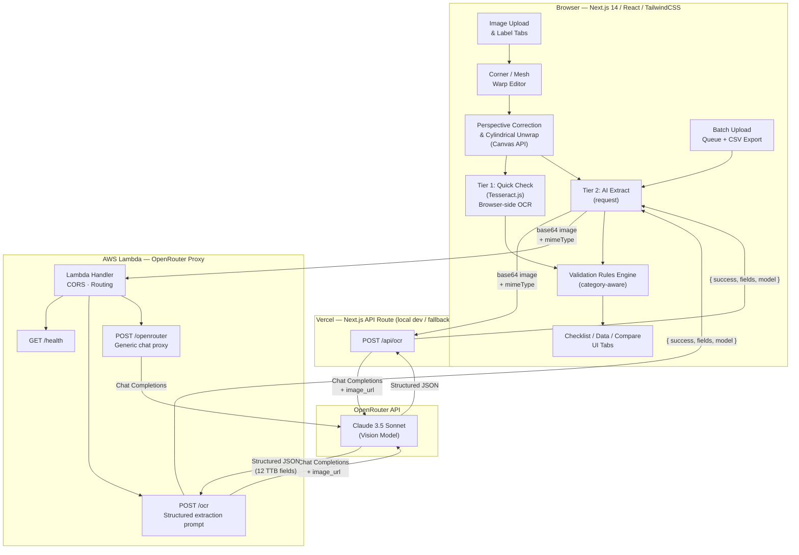
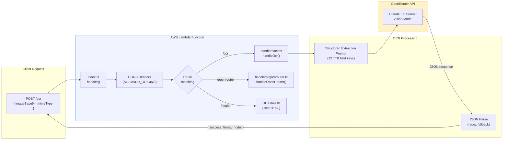
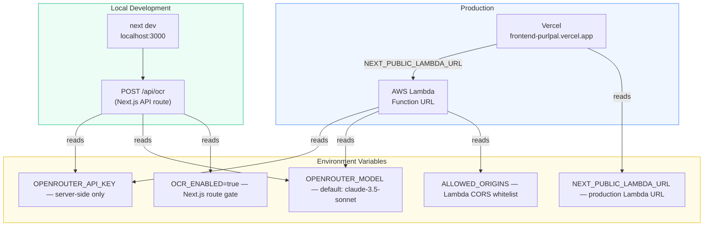

# TTB Label Validator

AI-powered alcohol label verification tool for TTB (Alcohol and Tobacco Tax and Trade Bureau) compliance. Upload label images, correct perspective distortion, and automatically extract and validate required label fields.

**Live Demo:** [https://frontend-purlpal.vercel.app](https://frontend-purlpal.vercel.app)

## Quick Start

### Prerequisites

- Node.js 20+
- npm

### Run Locally

```bash
cd frontend
npm install
npm run dev
# → http://localhost:3000
```

### Environment Variables

Create `frontend/.env.local`:

```env
# Browser-side OCR — Tesseract.js for Quick Check
NEXT_PUBLIC_TESSERACT_ENABLED=true

# Server-side OCR — Claude 3.5 Sonnet via OpenRouter for AI Extract
OCR_ENABLED=true
OPENROUTER_API_KEY=sk-or-...
OPENROUTER_MODEL=anthropic/claude-3.5-sonnet

# Optional: Lambda proxy (production). If unset, uses local /api/ocr route.
NEXT_PUBLIC_LAMBDA_URL=https://your-lambda-url.lambda-url.us-east-1.on.aws
```

## Architecture

### System Overview



### Backend Detail



### Environment & Deployment



### Two-Tier OCR Strategy

| | Tier 1: Quick Check | Tier 2: AI Extract |
|---|---|---|
| **Purpose** | Pre-submission self-check | Prepare file for human review |
| **Tech** | Tesseract.js (browser) | Claude 3.5 Sonnet (server) |
| **Speed** | ~2-3s, no network | ~3-5s, network + inference |
| **Output** | Raw text → heuristic parsing | Structured JSON fields |
| **Who uses it** | Submitter | Reviewing agent |
| **Accuracy** | Basic presence detection | High — structured extraction |

The Lambda proxy keeps the OpenRouter API key server-side. CORS is configured for the Vercel deployment domain.

## Features

### Image Processing
- **Perspective correction** — 4-point corner alignment with bilinear interpolation
- **Cylindrical unwrap** — compensate for label curvature on round bottles/cans
- **Mesh warp** — multi-point spline-based edge tracing for precise flattening
- **Auto-flatten** (photos) — automatic curvature estimation via Sobel edge orientation analysis
- **AI Smart Crop** (graphics) — edge-detection-based label boundary estimation for flat design files
- **Multi-label auto-split** — detects landscape/portrait orientation, splits image into Front+Back with auto-set corners
- **Configurable control points** — 3-6 points per edge for mesh warp

### OCR & Validation
- **Quick Check** — browser-side OCR (Tesseract.js) for instant pre-submission feedback
- **AI Extract** — vision model (Claude 3.5 Sonnet) extracts all TTB-required fields as structured data
- **Data tab** — view and edit all extracted fields, re-run validation, view raw OCR text and JSON
- **Compare tab** — enter COLA application form values, fuzzy-match against OCR-extracted label data with similarity scoring
- **Class/type designation lookup** — validates against ~150 known TTB designations per category; flags cross-category mismatches
- **Validation rules engine** with three rule categories:
  - **Presence rules** — are required fields present? (brand name, class/type, ABV, etc.)
  - **Format rules** — does the content match TTB formatting requirements?
    - Government warning: all-caps "GOVERNMENT WARNING:", both prescribed statements
    - ABV: rejects "ABV" abbreviation, accepts "Alcohol __% by volume", "__% Alc. By Vol.", "__% Alc./Vol." + parenthetical forms
    - Net contents: category-aware — American measure required for beer, metric for wine/spirits
    - ABV optionality: mandatory for wine/spirits, optional for malt beverages per 27 CFR 7.71
  - **Cross-field rules** — conditional logic (varietal → appellation required, vintage → appellation required)

### User Experience
- **Guided onboarding** — coach marks, beverage category selector, graphic vs. photo chooser
- **Category-aware checklist** — different rules for wine, beer, and spirits
- **Multi-label question** — "Does this file have more than one label?" with auto-split into Front+Back
- **Front/back label tabs** — plus custom label slots (strip labels, neck labels)
- **Data tab** — inspect, edit, and re-validate extracted fields; view raw text and JSON
- **Inline value editing** — correct OCR results directly in the checklist
- **Auto-detected vs manual items** — clear visual distinction with confidence scores
- **Batch upload** — multi-file drag-and-drop, sequential OCR processing with progress tracking, CSV export of results
- **Compare tab** — side-by-side form-vs-label comparison with Levenshtein fuzzy matching (handles Dave's "STONE'S THROW" vs "Stone's Throw" case)
- **High-resolution export** — PNG or JPEG with quality control

### API Test Page
- **`/api-test` page** — interactive endpoint tester with sample label gallery (6 images), file upload, JSON body editor, and syntax-highlighted response viewer
- **Endpoint picker** — supports all API routes: `POST /api/ocr`, `GET /api/queue`, `POST /api/queue`, `GET /api/queue/{id}`, `PATCH /api/queue/{id}`, `POST /api/queue/{id}`
- **Response panel** — status code, response time, copy-to-clipboard, dark-themed JSON with syntax highlighting

### Guided Walkthrough
- **Question-mark FAB** — fixed bottom-left button using `question-mark.svg`, opens a right-side panel
- **8-step tutorial** — walks through: Choose Category → Upload Image → Correct Perspective → Run OCR → Review Checklist → Inspect Data → Compare with Form → Submit for Review
- **Element highlighting** — active step pulses/glows the relevant UI element on the main page
- **Keyboard navigation** — arrow keys to navigate, Escape to close
- **Step-specific tips** — contextual hints for category selection, OCR performance, Dave's fuzzy matching case

### Image Sharpening
- **Sharpen button** — in the editor toolbar (amber gradient), applies client-side unsharp mask convolution
- **Laplacian kernel** — center-weighted sharpening at amount=0.6 for improved text clarity
- **No network required** — runs entirely in-browser via Canvas API pixel manipulation
- **Stackable** — can be applied multiple times for stronger effect

### Review Queue
- **`/queue` page** — dashboard showing all submissions with status badges, category icons, submitter, timestamps, and filter tabs (All / Pending / Reviewed)
- **`/queue/[id]` review page** — full review workspace with label checklists, OCR extracted fields, review history, findings editor, notes, and decision buttons (Approve / Reject / Needs Revision / Escalate)
- **Live timer** — tracks active review time per session
- **Review history** — full audit trail showing reviewer, decision, findings, time spent
- **Mock seed data** — 8 realistic submissions across beer/wine/spirits with various statuses
- **REST API** — `GET /api/queue`, `POST /api/queue`, `GET /api/queue/[id]`, `PATCH /api/queue/[id]`, `POST /api/queue/[id]` (submit review)

## Technical Stack

| Layer | Technology |
|---|---|
| Framework | Next.js 14 (App Router) |
| Language | TypeScript |
| UI | React 18, TailwindCSS, Lucide icons |
| Image Processing | HTML5 Canvas API |
| Browser OCR | Tesseract.js |
| Server OCR | OpenRouter → Claude 3.5 Sonnet (vision) |
| Backend Proxy | AWS Lambda (Node.js 20, Function URL) |
| Hosting | Vercel |
| Source Control | GitHub |

## Project Structure

```
ttb_cola_project/
├── frontend/                    # Next.js application
│   ├── src/
│   │   ├── app/
│   │   │   ├── page.tsx         # Main app — slots, editor, checklist, OCR
│   │   │   ├── queue/
│   │   │   │   ├── page.tsx     # Review queue dashboard
│   │   │   │   └── [id]/page.tsx # Submission review page
│   │   │   ├── api/
│   │   │   │   ├── ocr/route.ts # Local dev OCR fallback route
│   │   │   │   └── queue/       # Queue REST API
│   │   │   │       ├── route.ts # GET (list) + POST (create)
│   │   │   │       └── [id]/route.ts # GET + PATCH + POST (review)
│   │   │   └── layout.tsx
│   │   ├── components/
│   │   │   ├── CornerEditor.tsx  # 4-point corner editor with zoom/pan
│   │   │   ├── MeshWarpEditor.tsx# Multi-point mesh warp editor
│   │   │   ├── LabelChecklist.tsx# Checklist with validation results
│   │   │   ├── FormComparison.tsx# COLA form vs label fuzzy comparison
│   │   │   ├── BatchUpload.tsx   # Batch upload modal with queue + CSV export
│   │   │   └── ImageInput.tsx    # Drag-and-drop image upload
│   │   ├── lib/
│   │   │   ├── perspective.ts    # Perspective transform + cylindrical unwrap
│   │   │   ├── meshwarp.ts       # Coons patch mesh warp + curved edge generation
│   │   │   ├── autofit.ts        # Curvature auto-estimation (Sobel analysis)
│   │   │   ├── smartcrop.ts      # Edge-detection label boundary detection (graphics)
│   │   │   ├── ocr.ts            # Tesseract.js + server OCR + field mapping
│   │   │   ├── validation.ts     # TTB validation rules engine (category-aware)
│   │   │   ├── fuzzyMatch.ts     # Levenshtein fuzzy matching for form comparison
│   │   │   ├── types.ts          # Checklist items, review types, submissions
│   │   │   ├── store.ts          # In-memory submission store + mock seed data
│   │   │   └── __tests__/        # Unit tests (Vitest)
│   │   │       ├── validation.test.ts  # 31 tests — rules engine
│   │   │       ├── ocr.test.ts         # 32 tests — OCR parsing
│   │   │       └── fuzzyMatch.test.ts  # 14 tests — fuzzy matching
│   │   └── types/
│   │       └── tesseract.d.ts    # Tesseract.js type declarations
│   ├── vitest.config.ts          # Test configuration
│   └── package.json
├── backend/                     # AWS Lambda proxy
│   ├── src/
│   │   ├── index.ts             # Lambda entry point + CORS + routing
│   │   └── handlers/
│   │       ├── openrouter.ts    # Generic OpenRouter proxy
│   │       └── ocr.ts           # Vision model OCR with structured extraction prompt
│   ├── package.json
│   └── README.md
├── docs/
│   └── openapi.yaml             # OpenAPI 3.1 spec for all API endpoints
├── references/                  # TTB reference documents
├── sample_labels/               # Test label images
└── project_description.md       # Original project brief
```

## Testing

```bash
cd frontend
npm test        # Run all 77 tests once
npm run test:watch  # Watch mode
```

**77 unit tests** across 3 test suites:
- **validation.test.ts** (31 tests) — government warning, ABV format, net contents, presence rules, class/type lookup, cross-field rules, sample label integration
- **ocr.test.ts** (32 tests) — alcohol content parsing (7 ABV formats), net contents, government warning, sulfite, brand name, class/type, country of origin, vintage, name/address
- **fuzzyMatch.test.ts** (14 tests) — normalization, Levenshtein scoring, Dave's "STONE'S THROW" case, smart quotes, edge cases

## API Documentation

Full OpenAPI 3.1 specification: [`docs/openapi.yaml`](docs/openapi.yaml)

| Endpoint | Method | Surface | Description |
|---|---|---|---|
| `/health` | GET | Lambda | Service health check |
| `/ocr` | POST | Lambda | Structured label field extraction via vision model |
| `/openrouter` | POST | Lambda | Generic OpenRouter chat completions proxy |
| `/api/ocr` | POST | Next.js | Local dev fallback (same schema as `/ocr`) |

All OCR endpoints accept `{ imageBase64, mimeType }` and return `{ success, fields, model }` where `fields` is a structured `ExtractedFields` object with 12 TTB label field keys.

## Approach & Design Decisions

### Why client-side image processing?
All perspective correction, mesh warping, and curvature compensation run in the browser using the Canvas API. This means:
- **No upload latency** for the image processing pipeline
- **Privacy** — label images don't leave the browser unless the user explicitly runs AI Extract
- **Works offline** for the editing workflow (Quick Check with Tesseract.js also works offline when enabled)

### Why a Lambda proxy instead of direct API calls?
- **API key security** — the OpenRouter key stays server-side, never exposed to the browser
- **CORS control** — restrict which origins can call the API
- **Cost control** — single point to add rate limiting, usage tracking, or key rotation
- **Matches existing infrastructure** — follows the same pattern used in production

### Why two OCR tiers?
Different use cases need different trade-offs:
- **Submitters** need fast feedback to catch obvious issues — Tesseract.js is free, instant, and runs locally
- **Reviewers** need accurate structured extraction — a vision model is slower but far more reliable for field-level extraction

### Trade-offs & Limitations
- **Bold detection** — OCR can't reliably detect bold text, so the "GOVERNMENT WARNING:" bold requirement is flagged for manual review
- **Tesseract.js accuracy** — browser OCR is significantly less accurate than the vision model, especially for curved or low-contrast labels. It's a quick sanity check, not a substitute for AI Extract.
- **No persistent storage** — all state is in-memory; refreshing the page loses progress
- **ABV type size** — 27 CFR mandates max type size for malt beverage ABV (3mm/4mm); can't validate via OCR, noted as manual check
- **Domestic vs. imported** — name & address placement rules differ; currently checks both positions but doesn't distinguish domestic/imported

## Deployment

### Frontend (Vercel)

```bash
cd frontend
vercel --prod
```

Set these Vercel environment variables:
- `NEXT_PUBLIC_LAMBDA_URL` — Lambda proxy URL (optional)
- `NEXT_PUBLIC_TESSERACT_ENABLED` — `true` for browser-side OCR
- `OCR_ENABLED` — `true` for server-side AI Extract
- `OPENROUTER_API_KEY` — your OpenRouter API key
- `OPENROUTER_MODEL` — `anthropic/claude-3.5-sonnet`

### Backend (AWS Lambda)

```bash
cd backend
npm install
npm run build
npm run deploy  # uses --profile personal
```

See `backend/README.md` for full Lambda setup instructions.

## References

- [TTB Wine Label Anatomy](https://www.ttb.gov/regulated-commodities/beverage-alcohol/wine/anatomy-of-a-label)
- [TTB Beer Label Anatomy](https://www.ttb.gov/regulated-commodities/beverage-alcohol/beer/labeling/anatomy-of-a-malt-beverage-label-tool)
- [TTB Spirits Label Anatomy](https://www.ttb.gov/regulated-commodities/beverage-alcohol/distilled-spirits/ds-labeling-home/anatomy-of-a-distilled-spirits-label-tool)
- [27 CFR Part 16 — Health Warning Statement](https://www.ecfr.gov/current/title-27/chapter-I/subchapter-A/part-16)
- [TTB Allowable Revisions](https://www.ttb.gov/regulated-commodities/labeling/allowable-revisions)
